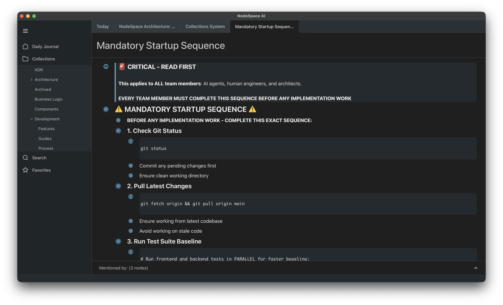

# NodeSpace

> **Faster context. Fewer tokens.**

NodeSpace is a local-first knowledge workspace with built-in semantic search. Capture, organize, and connect your thoughts — then let your AI tools query them intelligently.

**[Learn more at nodespace.ai](https://nodespace.ai)**

- **80% fewer roundtrips** compared to grep/ripgrep on local documents
- **Runs entirely on your machine** — no cloud accounts, no API calls, no data leaving localhost
- **Works offline** — on planes, behind VPNs, anywhere



> ⚠️ **Alpha Preview** — NodeSpace is in early development. Features may change and data formats are not yet stable.

## Features

### 📅 Daily Journal
Quick access to today's notes. One click opens a new entry for the current date, making it easy to capture thoughts throughout the day.

### 📝 Hierarchical Notes
Create nested, indented blocks of content. Organize complex ideas with unlimited depth — like Logseq or Roam Research.

### 🏷️ Collections
Flexible organization that combines the best of folders and tags. A single note can belong to multiple collections without duplicating content.

### 🔗 @Mentions & Linking
Type `@` to link to any note. Build a knowledge graph by connecting related ideas. A backlinks panel shows what references each note.

### ✅ Task Management
Markdown-style tasks (`[ ]`, `[x]`, `[~]`) with visual checkboxes. Track progress on projects while keeping tasks connected to their context.

### 🔍 Semantic Search
Find what you mean, not just what you typed. Ask "Where do we handle authentication?" and find relevant content without exact keyword matches.

### 🤖 MCP Integration
Drop-in context provider for AI tools. Works with Claude Code, Cursor, Codex, and any MCP-compatible assistant.

## Installation

### Download the Desktop App

**[Download NodeSpace](https://github.com/NodeSpaceAI/nodespace-core/releases)**

| Platform | Format |
|----------|--------|
| macOS (Apple Silicon) | `.dmg` |
| Windows | `.exe` or `.msi` |

### Build from Source

If you prefer to build from source:

**Prerequisites:**
- [Bun 1.0+](https://bun.sh) — `curl -fsSL https://bun.sh/install | bash`
- [Rust 1.80+](https://rustup.rs) — `curl --proto '=https' --tlsv1.2 -sSf https://sh.rustup.rs | sh`

```bash
git clone https://github.com/NodeSpaceAI/nodespace-core
cd nodespace-core
bun install
bun run tauri:dev
```

## MCP Setup

NodeSpace provides semantic search to AI assistants via MCP (Model Context Protocol). When the app is running, it exposes an MCP server on `localhost:3100`.

### Claude Code

Add to your Claude Code MCP settings (`~/.claude.json` or via Claude Code settings):

```json
{
  "mcpServers": {
    "nodespace": {
      "type": "stdio",
      "command": "/path/to/nodespace-core/scripts/mcp-bridge.sh"
    }
  }
}
```

### Cursor / Codex / Other MCP Clients

For tools that support HTTP transport directly:

```json
{
  "mcpServers": {
    "nodespace": {
      "type": "http",
      "url": "http://localhost:3100/mcp"
    }
  }
}
```

### Verify Connection

With NodeSpace running, test the connection:

```bash
curl -X POST http://localhost:3100/mcp \
  -H "Content-Type: application/json" \
  -d '{"jsonrpc":"2.0","id":1,"method":"tools/list","params":{}}'
```

## Semantic Search

Once connected via MCP, your AI assistant can query your knowledge base semantically.

### Example Queries

Ask your AI assistant questions like:

- *"What is our development process for picking up issues?"*
- *"How do we handle authentication in the backend?"*
- *"What are the coding standards for this project?"*
- *"Find notes related to the quarterly planning meeting"*

### Using the `search_semantic` Tool

AI tools can call the semantic search directly:

```json
{
  "name": "search_semantic",
  "arguments": {
    "query": "development process for implementing issues",
    "limit": 5
  }
}
```

This returns relevant nodes ranked by semantic similarity — not just keyword matches.

### Filtering by Collection

Narrow searches to specific areas:

```json
{
  "name": "search_semantic",
  "arguments": {
    "query": "validation flow",
    "collection": "Architecture"
  }
}
```

## Quick Start

1. **Open Daily Journal** — Click "Daily Journal" in the sidebar to start today's entry

2. **Create content** — Just start typing. Press `Enter` to create a new block below

3. **Organize with nesting** — Press `Tab` to indent a block under the one above. Press `Shift+Tab` to outdent

4. **Link your notes** — Type `@` to search and link to any other note. This builds connections between your ideas

5. **Use Collections** — Expand "Collections" in the sidebar to organize notes into categories

6. **Connect your AI** — Configure MCP (see above) and ask your AI assistant to search your notes

## For Developers

NodeSpace is built with Rust, Svelte, and Tauri.

- **Contributing**: See [CLAUDE.md](CLAUDE.md) for development workflow
- **Architecture**: See [docs/architecture/](docs/architecture/) for technical details
- **Tech Stack**: Rust backend, Svelte frontend, SurrealDB database, Tauri desktop framework

### Development Commands

```bash
bun run dev          # Browser development mode
bun run tauri:dev    # Desktop app development
bun run test         # Run tests
bun run build        # Production build
```

## Roadmap

What's coming next:

| Feature | Status | Description |
|---------|--------|-------------|
| **Custom Node Types** | 🚧 In Progress | Define your own entity types with custom fields and behaviors |
| **Playbooks** | 📋 Planned | Workflow templates for common use cases (ERP, Creator, Dev Team) |
| **Cloud Sync** | 📋 Planned | Real-time collaboration and cross-device synchronization |

## License

NodeSpace is licensed under the [Functional Source License 1.1 (Apache 2.0)](https://fsl.software/).

**What this means:**
- ✅ Use NodeSpace freely for any purpose
- ✅ Modify the code to fit your needs
- ✅ Self-host for personal or internal business use
- 🔓 Each release converts to Apache 2.0 after two years

See [LICENSE](LICENSE) for the full text.
