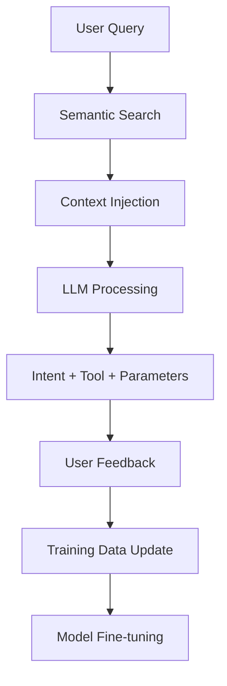

# NodeSpace Training Data Evolution Strategy

## Overview

This document outlines the evolution of NodeSpace's AI training data from basic intent classification to sophisticated schema-aware function calling, supporting our privacy-first local AI deployment strategy.

## Current State (Phase 1: Foundation)

### Basic Intent Classification

**Current Intent Categories:**
- `create_schema`: Database structure creation
- `retrieve_data`: Querying structured data
- `update_record`: Modifying existing records
- `delete_data`: Removing records
- `aggregate`: Calculations and analytics
- `rag_search`: Document/knowledge base search
- `create_workflow`: Business process automation

### Current Training Data Structure

```json
{
  "text": "<bos><start_of_turn>user\nYou are an expert intent classifier...\nCreate a customer database<end_of_turn>\n<start_of_turn>model\n{\"intent\": \"create_schema\", \"ambiguity_level\": \"clear\", \"confidence\": 0.95, \"alternative_intents\": [], \"clarification_needed\": null}<end_of_turn>\n"
}
```

**Key Challenges Identified:**
1. `rag_search` vs `retrieve_data` distinction requires entity context
2. Clean JSON output consistency
3. Need for proper confidence calibration

## Evolution Roadmap

### Phase 2: Function Integration

**Objective**: Add tool/function calling capabilities to intent classification

**Enhanced Data Structure:**
```json
{
  "user_request": "Update customer tier for premium users",
  "context": {
    "available_tools": [
      {
        "name": "crud_operations",
        "description": "CRUD operations on entities",
        "parameters": {
          "entity": "string",
          "operation": "enum[create,read,update,delete]",
          "filters": "object",
          "data": "object"
        }
      },
      {
        "name": "search_documents",
        "description": "Search knowledge base documents",
        "parameters": {
          "query": "string",
          "document_types": "array"
        }
      }
    ]
  },
  "response": {
    "intent": "update_record",
    "tool": "crud_operations",
    "parameters": {
      "entity": "customers",
      "operation": "update",
      "filters": {"tier": "premium"},
      "data": {"tier": "new_tier_value"}
    },
    "confidence": 0.95
  }
}
```

**Training Data Requirements:**
- 50 examples per intent + tool combination
- Function parameter extraction examples
- Error handling and validation cases

### Phase 3: Schema-Aware Operations

**Objective**: Dynamic entity schema awareness with user-created entities

**Advanced Data Structure:**
```json
{
  "user_request": "Create a new project tracking entity",
  "knowledge_context": {
    "existing_entities": [
      {
        "name": "customers",
        "type": "built_in",
        "schema": {
          "id": {"type": "uuid", "required": true},
          "name": {"type": "string", "required": true},
          "tier": {"type": "enum", "values": ["basic", "premium", "enterprise"]}
        }
      }
    ],
    "relevant_documents": [
      {
        "title": "Entity Design Guidelines",
        "content": "Best practices for creating NodeSpace entities...",
        "relevance_score": 0.95
      }
    ]
  },
  "response": {
    "intent": "create_schema",
    "tool": "entity_builder",
    "parameters": {
      "entity_name": "project_tracking",
      "suggested_schema": {
        "id": {"type": "uuid", "required": true},
        "name": {"type": "string", "required": true},
        "status": {"type": "enum", "values": ["planning", "active", "completed"]},
        "created_at": {"type": "timestamp", "auto_generated": true}
      }
    },
    "reasoning": "Based on NodeSpace conventions and similar entities",
    "confidence": 0.88
  }
}
```

**Key Features:**
- **Semantic Entity Retrieval**: Vector search to find relevant entities/docs
- **Dynamic Context Injection**: Only include pertinent schema information
- **Schema Validation**: Ensure new entities follow NodeSpace patterns
- **Cross-Entity Relationships**: Suggest foreign keys and relationships

### Phase 4: Production Refinement

**Objective**: Continuous learning from real user interactions

**Production Data Collection:**
```json
{
  "user_request": "Find all projects that are overdue",
  "user_feedback": {
    "suggested_intent": "retrieve_data",
    "suggested_tool": "crud_operations",
    "user_correction": {
      "intent": "aggregate",
      "reasoning": "User wanted count of overdue projects, not list"
    }
  },
  "session_context": {
    "previous_actions": [...],
    "user_role": "project_manager",
    "workspace_entities": [...]
  }
}
```

## Implementation Strategy

### Data Generation Approach

**Phase 1 (Current): Synthetic Data**
- Hand-crafted examples based on successful patterns
- 80% clear examples (high confidence)
- 15% uncertain examples (medium confidence)
- 5% complex examples (multi-step operations)

**Phase 2: Semi-Synthetic**
- Template-based generation with function variations
- Parameterized examples for different entity types
- Edge case simulation for error handling

**Phase 3: Hybrid Approach**
- Real user queries (anonymized)
- Synthetic schema variations
- Community-contributed examples

**Phase 4: Production Learning**
- Active learning from user corrections
- A/B testing different response strategies
- Continuous model updates

### Privacy-First Considerations

**Local Processing:**
- All training data generation happens locally
- User data never leaves NodeSpace instance
- Model fine-tuning performed on user's hardware

**Federated Learning (Future):**
- Aggregate improvements across instances
- Differential privacy for shared learnings
- Opt-in community model improvements

## Technical Implementation

### Training Data Pipeline



### Data Storage Format

**JSONL Structure:**
```jsonl
{"phase": "1", "version": "1.0", "type": "intent_classification", "data": {...}}
{"phase": "2", "version": "2.0", "type": "function_calling", "data": {...}}
{"phase": "3", "version": "3.0", "type": "schema_aware", "data": {...}}
```

**Version Control:**
- Semantic versioning for training data
- Backward compatibility for model updates
- A/B testing infrastructure

### Evaluation Metrics

**Core Metrics:**
- **Intent Accuracy**: Correct intent classification
- **Tool Selection**: Appropriate function chosen
- **Parameter Extraction**: Correct function parameters
- **Schema Compliance**: Valid entity operations

**User Experience Metrics:**
- **Task Completion Rate**: Successful end-to-end operations
- **User Correction Frequency**: How often users need to correct the AI
- **Response Confidence**: Model certainty in predictions

## Success Criteria

### Phase 1 (Current)
- 90%+ accuracy on basic intent classification
- Clean JSON output format
- Optimized training data with proper ML balance

### Phase 2 (Function Integration)
- 95%+ accuracy on intent + tool selection
- 90%+ accuracy on parameter extraction
- Support for 10+ core NodeSpace functions

### Phase 3 (Schema-Aware)
- Dynamic entity schema understanding
- 95%+ accuracy with user-created entities
- Context-aware disambiguation (rag_search vs retrieve_data)

### Phase 4 (Production)
- Real-time learning from user feedback
- Sub-second response times
- 99%+ reliability in production workloads

## Iterative Development Process

### Model Selection & Refinement Cycle

1. **Foundation Phase**: Establish baseline intent classification
2. **Function Integration**: Add tool calling capabilities to training data
3. **Schema Evolution**: Implement custom entity awareness
4. **Production Optimization**: Continuous learning from real usage

### Training Data Expansion Strategy

As NodeSpace functions evolve, training data will be incrementally expanded:

- **New function added** → Generate 20-50 training examples
- **Schema changes** → Update context-aware examples
- **User feedback patterns** → Create targeted improvement examples
- **Edge case discovery** → Add robustness training data

This approach ensures the AI model grows alongside NodeSpace's capabilities while maintaining high performance and user satisfaction.

## Next Steps

1. Complete optimized training dataset for Phase 1
2. Design initial NodeSpace function API surface
3. Create Phase 2 training data with function calling examples
4. Implement evaluation framework for multi-phase metrics
5. Build training pipeline for continuous model improvement