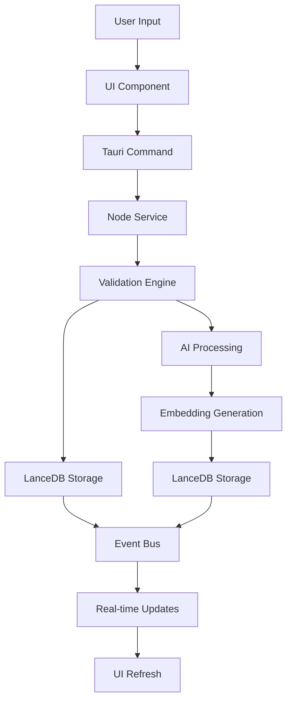
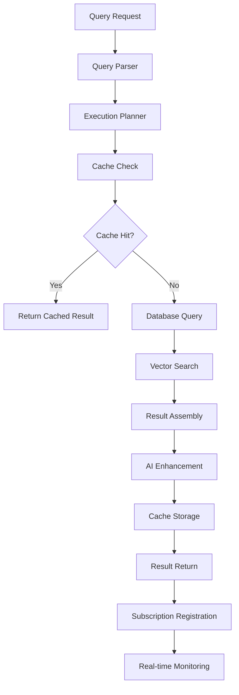
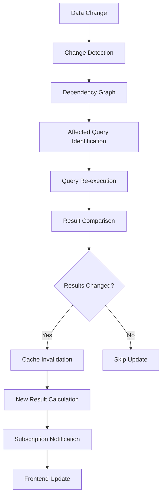
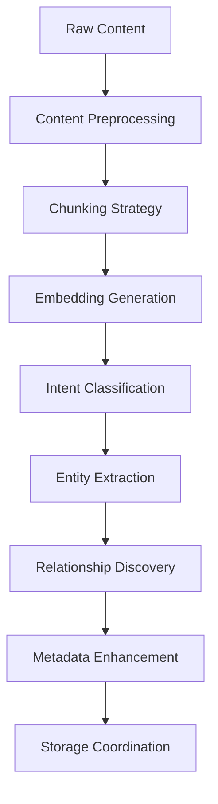
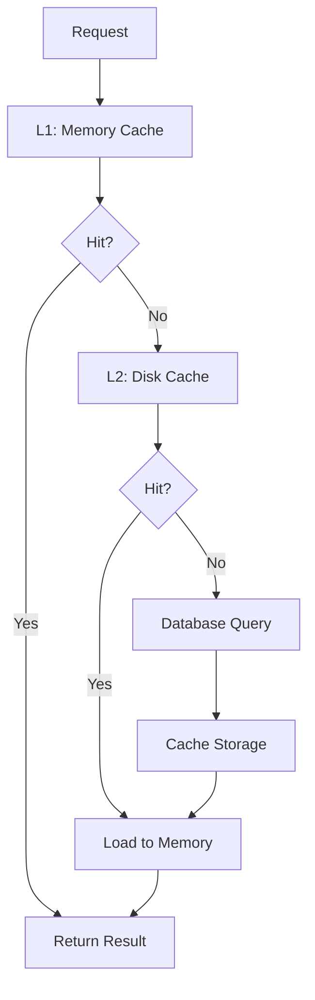

# Data Flow Architecture

## Overview

NodeSpace's data flow architecture is designed to handle complex interactions between hierarchical content, AI processing, real-time updates, and persistent storage. The system maintains consistency across multiple data stores while providing responsive user experiences through intelligent caching and event-driven updates.

## Core Data Flow Patterns

### 1. Node Creation Flow



**Detailed Steps:**
1. **User Interaction**: User creates content through UI (text, entity, query, etc.)
2. **Frontend Processing**: Svelte component captures input and validates format
3. **Backend Communication**: Tauri IPC command sends data to Rust backend
4. **Business Logic**: Node service applies business rules and transformations
5. **Validation**: Comprehensive validation including AI-assisted checks
6. **Primary Storage**: Node data persisted to LanceDB with ACID guarantees
7. **AI Enhancement**: Content processed for embeddings and AI annotations
8. **Vector Storage**: Embeddings stored in LanceDB for similarity search
9. **Event Propagation**: Changes broadcast through event system
10. **UI Updates**: Real-time updates pushed to all connected components

### 2. Query Processing Flow



**Query Types:**
- **Simple Queries**: Direct database lookups with caching
- **Vector Queries**: Semantic search using LanceDB embeddings
- **Complex Queries**: Multi-stage processing with AI assistance
- **Live Queries**: Continuous monitoring with automatic updates

### 3. Real-Time Update Flow



**Change Propagation:**
- **Direct Changes**: Immediate update of affected components
- **Calculated Fields**: Dependency-aware recalculation cascades
- **Query Results**: Automatic re-execution and comparison
- **UI Synchronization**: Reactive updates across all views

## Data Store Interactions

### LanceDB Operations

**Node Storage Pattern:**
```rust
pub async fn create_node<T: Node>(
    &self,
    node: &T,
    tx: &mut lance::Transaction
) -> Result<(), StorageError> {
    // 1. Validate node structure
    self.validate_node_structure(node)?;
    
    // 2. Insert base node record
    let node_id = self.insert_base_node(node, tx).await?;
    
    // 3. Insert type-specific data
    self.insert_node_data(node_id, node.type_specific_data(), tx).await?;
    
    // 4. Update parent-child relationships
    if let Some(parent_id) = node.parent_id() {
        self.update_parent_children(parent_id, node_id, tx).await?;
    }
    
    // 5. Create audit trail
    self.create_audit_record(node_id, AuditAction::Create, tx).await?;
    
    Ok(())
}
```

**Query Patterns:**
- **Hierarchical Queries**: Recursive CTEs for tree traversal
- **Complex Queries**: Native LanceDB operations for flexible schemas
- **Full-Text Search**: Built-in text search with custom ranking
- **Aggregation Queries**: Complex analytics with window functions

### LanceDB Operations

**Embedding Storage Pattern:**
```rust
pub async fn store_embeddings(
    &self,
    node_id: &str,
    content: &str,
    embeddings: Vec<f32>
) -> Result<(), EmbeddingError> {
    let record = EmbeddingRecord {
        node_id: node_id.to_string(),
        content_hash: self.hash_content(content),
        embedding: embeddings,
        metadata: self.extract_metadata(content),
        created_at: Utc::now(),
    };
    
    // Store with automatic indexing
    self.table.add(vec![record]).await?;
    
    // Update search index
    self.rebuild_index_if_needed().await?;
    
    Ok(())
}
```

**Search Patterns:**
- **Similarity Search**: Vector distance calculations with filtering
- **Hybrid Search**: Combining vector similarity with metadata filters
- **Batch Operations**: Efficient bulk insertion and updates
- **Index Management**: Automatic optimization for query performance

## AI Processing Pipeline

### 1. Content Analysis Flow



**Processing Steps:**
1. **Preprocessing**: Clean and normalize input content
2. **Chunking**: Split large content into processable segments
3. **Embedding**: Generate vector representations using local model
4. **Classification**: Identify content type and user intent
5. **Extraction**: Pull out entities, relationships, and structure
6. **Discovery**: Find connections to existing content
7. **Enhancement**: Add AI-generated metadata and annotations
8. **Coordination**: Ensure consistent storage across systems

### 2. Natural Language Processing

**AI Request Pipeline:**
```rust
pub async fn process_natural_language_request(
    &self,
    user_input: &str,
    context: &RequestContext
) -> Result<AIResponse, AIError> {
    // 1. Intent classification
    let intent = self.classify_intent(user_input).await?;
    
    // 2. Context retrieval
    let relevant_context = self.retrieve_context(&intent, context).await?;
    
    // 3. Prompt construction
    let prompt = self.build_contextual_prompt(user_input, &relevant_context, &intent);
    
    // 4. AI inference
    let raw_response = self.ai_engine.generate(&prompt).await?;
    
    // 5. Response parsing
    let structured_response = self.parse_ai_response(&raw_response, &intent)?;
    
    // 6. Action execution
    let result = self.execute_ai_actions(&structured_response, context).await?;
    
    Ok(result)
}
```

**Intent Types:**
- **Create**: Generate new nodes with specified content
- **Update**: Modify existing nodes based on natural language
- **Query**: Search and retrieve information with AI assistance
- **Analyze**: Perform analysis and generate insights
- **Validate**: Check business rules and data consistency

## Caching Architecture

### Multi-Layer Cache Strategy



**Cache Layers:**
1. **L1 Memory Cache**: In-memory HashMap for frequently accessed data
2. **L2 Disk Cache**: Persistent cache for query results and embeddings
3. **Database Cache**: LanceDB query cache and result optimization
4. **AI Model Cache**: Loaded model state and recent inference results

**Cache Invalidation:**
```rust
pub struct CacheInvalidationEngine {
    dependency_graph: DependencyGraph,
    invalidation_rules: Vec<InvalidationRule>,
    cache_layers: Vec<Box<dyn CacheLayer>>,
}

impl CacheInvalidationEngine {
    pub async fn invalidate_dependent_caches(
        &mut self,
        changed_node_id: &str,
        change_type: ChangeType
    ) -> Result<InvalidationResult, CacheError> {
        // 1. Find dependent nodes
        let dependents = self.dependency_graph.find_dependents(changed_node_id);
        
        // 2. Apply invalidation rules
        let affected_keys = self.apply_invalidation_rules(&dependents, change_type);
        
        // 3. Invalidate across all cache layers
        let mut results = Vec::new();
        for layer in &mut self.cache_layers {
            let result = layer.invalidate_keys(&affected_keys).await?;
            results.push(result);
        }
        
        Ok(InvalidationResult::from_layer_results(results))
    }
}
```

## Event-Driven Updates

### Event Bus Architecture

```rust
pub struct EventBus {
    channels: HashMap<EventType, Vec<Sender<Event>>>,
    processors: Vec<Box<dyn EventProcessor>>,
    error_handler: Box<dyn ErrorHandler>,
}

pub enum EventType {
    NodeCreated { node_id: String, node_type: NodeType },
    NodeUpdated { node_id: String, changes: Vec<FieldChange> },
    NodeDeleted { node_id: String },
    QueryResultChanged { query_id: String, new_results: QueryResults },
    AIProcessingComplete { node_id: String, analysis: AIAnalysis },
    CacheInvalidated { cache_keys: Vec<String> },
}

impl EventBus {
    pub async fn publish(&self, event: Event) -> Result<(), EventError> {
        // 1. Route to appropriate channels
        if let Some(channels) = self.channels.get(&event.event_type()) {
            for channel in channels {
                channel.send(event.clone()).await?;
            }
        }
        
        // 2. Process through event processors
        for processor in &self.processors {
            processor.process(&event).await?;
        }
        
        Ok(())
    }
}
```

**Event Processors:**
- **Real-time Query Updater**: Monitors for changes affecting live queries
- **Cache Invalidation Processor**: Handles cache consistency
- **AI Analysis Trigger**: Initiates background AI processing
- **Audit Logger**: Records all significant events for debugging
- **UI Notification System**: Sends updates to frontend components

## Performance Optimizations

### 1. Query Optimization

**Execution Plan Optimization:**
```rust
pub struct QueryOptimizer {
    statistics: QueryStatistics,
    index_advisor: IndexAdvisor,
    cache_analyzer: CacheAnalyzer,
}

impl QueryOptimizer {
    pub fn optimize_query(&self, query: &Query) -> OptimizedQuery {
        let mut optimized = query.clone();
        
        // 1. Index-based optimizations
        optimized = self.apply_index_hints(optimized);
        
        // 2. Cache-aware planning
        optimized = self.plan_cache_usage(optimized);
        
        // 3. Vector search optimization
        if query.has_vector_component() {
            optimized = self.optimize_vector_search(optimized);
        }
        
        // 4. Parallel execution planning
        optimized = self.plan_parallel_execution(optimized);
        
        OptimizedQuery::new(optimized, self.generate_execution_plan(&optimized))
    }
}
```

### 2. Batch Processing

**Bulk Operations:**
```rust
pub async fn batch_process_nodes(
    &self,
    operations: Vec<NodeOperation>
) -> Result<BatchResult, BatchError> {
    let batch_size = 100; // Configurable
    let mut results = Vec::new();
    
    for chunk in operations.chunks(batch_size) {
        // 1. Start database transaction
        let mut tx = self.storage.begin_transaction().await?;
        
        // 2. Process chunk operations
        let chunk_results = self.process_operation_chunk(chunk, &mut tx).await?;
        
        // 3. Batch AI processing
        if chunk.iter().any(|op| op.requires_ai()) {
            let ai_results = self.batch_ai_processing(chunk).await?;
            self.merge_ai_results(&mut chunk_results, ai_results);
        }
        
        // 4. Commit transaction
        tx.commit().await?;
        
        results.extend(chunk_results);
    }
    
    Ok(BatchResult::new(results))
}
```

## Error Handling and Recovery

### Distributed Transaction Handling

```rust
pub struct TransactionCoordinator {
    lance_client: lance::Connection,
    lancedb_client: LanceDBClient,
    cache_manager: CacheManager,
}

impl TransactionCoordinator {
    pub async fn execute_distributed_transaction<F, R>(
        &self,
        operation: F
    ) -> Result<R, TransactionError> 
    where
        F: FnOnce(&mut DistributedTransaction) -> Result<R, TransactionError>
    {
        let mut distributed_tx = DistributedTransaction::new();
        
        // 1. Begin all transactions
        distributed_tx.lance_tx = Some(self.lance_client.begin().await?);
        distributed_tx.lancedb_tx = Some(self.lancedb_client.begin().await?);
        
        // 2. Execute operation
        match operation(&mut distributed_tx) {
            Ok(result) => {
                // 3. Commit all transactions
                if let Some(tx) = distributed_tx.lance_tx {
                    tx.commit().await?;
                }
                if let Some(tx) = distributed_tx.lancedb_tx {
                    tx.commit().await?;
                }
                
                // 4. Clear affected caches
                self.cache_manager.invalidate_transaction_caches(&distributed_tx).await?;
                
                Ok(result)
            }
            Err(e) => {
                // 5. Rollback all transactions
                if let Some(tx) = distributed_tx.lance_tx {
                    tx.rollback().await?;
                }
                if let Some(tx) = distributed_tx.lancedb_tx {
                    tx.rollback().await?;
                }
                
                Err(e)
            }
        }
    }
}
```

## Monitoring and Observability

### Data Flow Metrics

```rust
pub struct DataFlowMetrics {
    node_creation_rate: Counter,
    query_execution_time: Histogram,
    cache_hit_ratio: Gauge,
    ai_processing_latency: Histogram,
    event_processing_rate: Counter,
    error_rate: Counter,
}

impl DataFlowMetrics {
    pub fn record_node_operation(&self, operation: &NodeOperation, duration: Duration) {
        self.node_creation_rate.increment();
        
        match operation {
            NodeOperation::Create(_) => {
                self.query_execution_time.observe(duration.as_secs_f64());
            }
            NodeOperation::Update(_) => {
                // Record update-specific metrics
            }
            // ... other operations
        }
    }
    
    pub fn record_cache_access(&self, hit: bool) {
        if hit {
            self.cache_hit_ratio.set(self.calculate_hit_ratio());
        }
    }
}
```

**Observability Features:**
- **Request Tracing**: End-to-end request flow tracking
- **Performance Metrics**: Latency, throughput, and resource usage
- **Error Tracking**: Comprehensive error logging and analysis
- **Cache Analytics**: Hit ratios, invalidation patterns, and optimization opportunities
- **AI Performance**: Model inference times and accuracy metrics

---

This data flow architecture ensures consistent, performant, and reliable data processing across all NodeSpace components while maintaining the flexibility needed for AI-native knowledge management features.