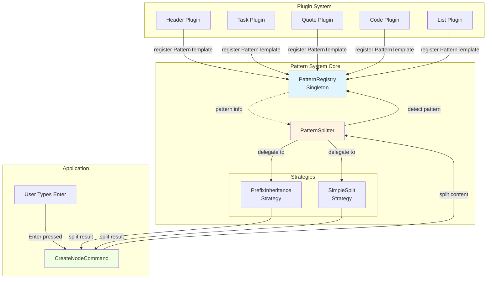
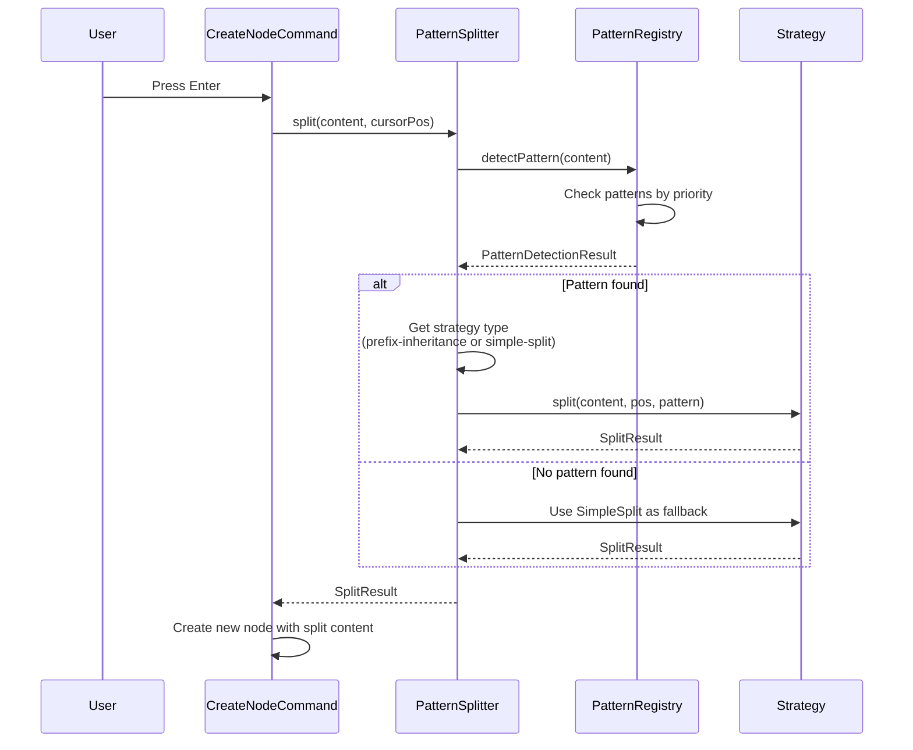
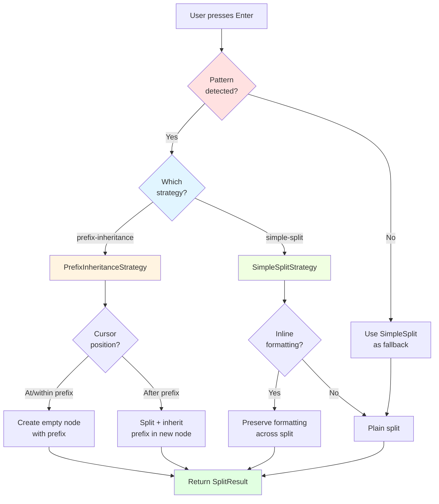
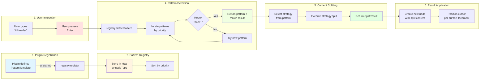

# Pattern Detection and Content Templates

## Overview

NodeSpace provides two mechanisms for creating and converting node types:
1. **Slash Commands** - User explicitly selects a node type from the `/` menu
2. **Pattern Detection** - Automatic conversion based on markdown-like patterns (e.g., `# ` → header, `` ``` `` → code-block)

Both mechanisms share a **unified template system** that allows you to specify default content when a node is created or converted.

---

## Template System Architecture

### Core Concept

Both slash commands and pattern detection use `contentTemplate` to specify what content should be set when a node is created:

```typescript
// Slash command with template
slashCommands: [
  {
    id: 'code',
    name: 'Code Block',
    contentTemplate: '```\n\n```',  // ← Template applied when command is selected
    nodeType: 'code-block',
    desiredCursorPosition: 4
  }
]

// Pattern detection with template
patternDetection: [
  {
    pattern: /^```(\w+)?\n/,
    targetNodeType: 'code-block',
    contentTemplate: '```\n\n```',  // ← Template applied when pattern matches
    desiredCursorPosition: 4
  }
]
```

### Template Processing Flow

**1. Slash Command Flow:**
```
User types "/"
  → Selects "Code Block" from menu
    → `contentTemplate` is retrieved from plugin definition
      → Content is set to '```\n\n```'
        → Cursor positioned at `desiredCursorPosition` (4)
          → CodeBlockNode component mounts with complete template
```

**2. Pattern Detection Flow:**
```
User types "```\n"
  → Pattern /^```(\w+)?\n/ matches
    → `contentTemplate` is retrieved from plugin definition
      → Content is set to '```\n\n```' (NOT the matched text)
        → `nodeTypeChanged` event fires with cleanedContent
          → base-node-viewer updates both nodeType AND content
            → CodeBlockNode component mounts with complete template
```

---

## Pattern Detection Configuration

### PatternDetectionConfig Interface

```typescript
interface PatternDetectionConfig {
  // Pattern to match in content
  pattern: RegExp | string;

  // Target node type when pattern matches
  targetNodeType: string;

  // How to handle matched content (priority order):
  // 1. contentTemplate (highest priority) - replaces content with template
  // 2. cleanContent - removes pattern from content
  // 3. default - keeps pattern in content

  contentTemplate?: string;        // NEW: Template to apply (e.g., '```\n\n```')
  cleanContent?: boolean;          // Remove pattern from content

  // Extract metadata from pattern match
  extractMetadata?: (match: RegExpMatchArray) => Record<string, unknown>;

  // Cursor positioning after conversion
  desiredCursorPosition?: number;

  // Priority for overlapping patterns
  priority?: number;
}
```

### Content Processing Priority

When a pattern is detected, content is processed in this order:

```typescript
if (config.contentTemplate) {
  // 1. Use template (highest priority)
  cleanedContent = config.contentTemplate;
} else if (config.cleanContent) {
  // 2. Remove pattern from content
  cleanedContent = content.replace(match[0], '');
} else {
  // 3. Keep pattern in content (default)
  cleanedContent = content;
}
```

### Examples

#### Example 1: Code Block (with template)

**Use Case:** User types `` ``` ``, needs closing fence auto-completed.

```typescript
{
  pattern: /^```(\w+)?\n/,
  targetNodeType: 'code-block',
  contentTemplate: '```\n\n```',    // Auto-complete closing fence
  extractMetadata: (match) => ({
    language: match[1]?.toLowerCase() || 'plaintext'
  }),
  desiredCursorPosition: 4,         // Position after opening fence
  priority: 10
}
```

**Result:**
- User types: `` ```\n``
- Pattern matches
- Content becomes: `` ```\n\n``` ``
- Cursor at position 4 (between fences)

#### Example 2: Task (remove pattern)

**Use Case:** User types `[ ] `, pattern should be removed (checkbox shown in icon instead).

```typescript
{
  pattern: /^[-*+]?\s*\[\s*[xX\s]\s*\]\s/,
  targetNodeType: 'task',
  cleanContent: true,               // Remove "[ ]" from content
  extractMetadata: (match) => ({
    taskState: /[xX]/.test(match[0]) ? 'completed' : 'pending'
  }),
  priority: 10
}
```

**Result:**
- User types: `[ ] Buy milk`
- Pattern matches
- Content becomes: `Buy milk` (pattern removed)
- Task state set to 'pending' via metadata

#### Example 3: Header (keep pattern)

**Use Case:** User types `# `, pattern should remain for editing.

```typescript
{
  pattern: /^(#{1,6})\s/,
  targetNodeType: 'header',
  cleanContent: false,              // Keep "# " in content
  extractMetadata: (match) => ({
    headerLevel: match[1].length
  }),
  priority: 10
}
```

**Result:**
- User types: `# Hello`
- Pattern matches
- Content stays: `# Hello` (pattern kept)
- Header level set to 1 via metadata

#### Example 4: Quote Block (keep pattern + set cursor)

**Use Case:** User types `> `, pattern remains but cursor positioned after it.

```typescript
{
  pattern: /^>\s/,
  targetNodeType: 'quote-block',
  cleanContent: false,              // Keep "> " in content
  desiredCursorPosition: 2,         // Place cursor after "> "
  priority: 10
}
```

**Result:**
- User types: `> `
- Pattern matches
- Content stays: `> ` (pattern kept)
- Cursor at position 2 (after "> ")

---

## Slash Command Configuration

### SlashCommandDefinition Interface

```typescript
interface SlashCommandDefinition {
  id: string;
  name: string;
  description: string;
  shortcut?: string;

  contentTemplate: string;          // Template applied when command selected
  nodeType?: string;                // Target node type

  desiredCursorPosition?: number;   // Cursor position after insertion
  priority?: number;
}
```

### Examples

#### Code Block Slash Command

```typescript
{
  id: 'code',
  name: 'Code Block',
  description: 'Create a code block with language selection',
  shortcut: '```',
  contentTemplate: '```\n\n```',
  nodeType: 'code-block',
  desiredCursorPosition: 4
}
```

#### Header Slash Commands

```typescript
{
  id: 'header1',
  name: 'Header 1',
  description: 'Create a large header',
  shortcut: '#',
  contentTemplate: '# ',
  nodeType: 'header'
},
{
  id: 'header2',
  name: 'Header 2',
  description: 'Create a medium header',
  shortcut: '##',
  contentTemplate: '## ',
  nodeType: 'header'
}
```

---

## Best Practices

### When to Use contentTemplate

**Use `contentTemplate` when:**
1. ✅ Pattern needs auto-completion (e.g., closing fence for code blocks)
2. ✅ Default structure should be provided (e.g., table template)
3. ✅ Pattern creates structured content

**Don't use `contentTemplate` when:**
1. ❌ User's typed content should be preserved
2. ❌ Pattern is just a trigger (use `cleanContent` instead)
3. ❌ Content varies significantly per use case

### Consistency Between Slash Commands and Pattern Detection

For a consistent user experience, slash commands and pattern detection should produce **identical results**:

```typescript
// ✅ GOOD: Both produce the same result
slashCommand: {
  contentTemplate: '```\n\n```',
  desiredCursorPosition: 4
}
patternDetection: {
  contentTemplate: '```\n\n```',
  desiredCursorPosition: 4
}

// ❌ BAD: Inconsistent results
slashCommand: {
  contentTemplate: '```\n\n```',  // Complete template
}
patternDetection: {
  cleanContent: false              // User gets incomplete "```\n"
}
```

### Cursor Positioning

Always set `desiredCursorPosition` when using `contentTemplate`:

```typescript
// ✅ GOOD: Cursor positioned correctly
{
  contentTemplate: '```\n\n```',
  desiredCursorPosition: 4  // After "```\n"
}

// ⚠️ WARNING: Cursor will be at position 0 (beginning)
{
  contentTemplate: '```\n\n```'
  // Missing desiredCursorPosition
}
```

---

## Implementation Details

### Where Templates Are Applied

**1. Pattern Detection (textarea-controller.ts)**

```typescript
// Calculate cleaned content based on plugin config
let cleanedContent: string;
if (config.contentTemplate) {
  // Use template if provided (e.g., code-block: "```\n" → "```\n\n```")
  cleanedContent = config.contentTemplate;
} else if (config.cleanContent) {
  // Remove pattern from content (e.g., task: "[ ] text" → "text")
  cleanedContent = content.replace(match[0], '');
} else {
  // Keep pattern in content (e.g., headers: "# Hello" → "# Hello")
  cleanedContent = content;
}
```

**2. Event Propagation (base-node.svelte)**

```typescript
dispatch('nodeTypeChanged', {
  nodeType: data.newNodeType,
  cleanedContent: data.cleanedContent,  // ← Template content
  cursorPosition: data.cursorPosition
});
```

**3. Content Update (base-node-viewer.svelte)**

```typescript
const cleanedContent = e.detail.cleanedContent;

// Update content if cleanedContent is provided (e.g., from contentTemplate)
if (cleanedContent !== undefined) {
  nodeManager.updateNodeContent(node.id, cleanedContent);
}

// Update node type through proper API (triggers component re-render)
nodeManager.updateNodeType(node.id, newNodeType);
```

**4. Slash Commands (slash-command-service.ts)**

```typescript
const pluginCommand = pluginRegistry.findSlashCommand(command.id);

if (pluginCommand) {
  return {
    content: pluginCommand.contentTemplate || '',  // ← Template content
    nodeType: command.nodeType,
    headerLevel: command.headerLevel,
    desiredCursorPosition: pluginCommand.desiredCursorPosition
  };
}
```

---

## Testing Template Behavior

### Unit Tests

Test both slash commands and pattern detection:

```typescript
describe('ContentTemplate System', () => {
  it('should apply template from slash command', () => {
    const commands = pluginRegistry.getAllSlashCommands();
    const codeCommand = commands.find(c => c.id === 'code');

    expect(codeCommand?.contentTemplate).toBe('```\n\n```');
    expect(codeCommand?.desiredCursorPosition).toBe(4);
  });

  it('should apply template from pattern detection', () => {
    const patterns = pluginRegistry.getAllPatternDetectionConfigs();
    const codePattern = patterns.find(p => p.targetNodeType === 'code-block');

    expect(codePattern?.contentTemplate).toBe('```\n\n```');
    expect(codePattern?.desiredCursorPosition).toBe(4);
  });

  it('should produce identical results for both methods', () => {
    const commands = pluginRegistry.getAllSlashCommands();
    const patterns = pluginRegistry.getAllPatternDetectionConfigs();

    const slashCommand = commands.find(c => c.id === 'code');
    const patternDetection = patterns.find(p => p.targetNodeType === 'code-block');

    expect(slashCommand?.contentTemplate).toBe(patternDetection?.contentTemplate);
    expect(slashCommand?.desiredCursorPosition).toBe(patternDetection?.desiredCursorPosition);
  });
});
```

### Integration Tests

Verify end-to-end behavior in actual components.

---

## Troubleshooting

### Issue: Pattern detection doesn't apply template

**Symptoms:**
- User types pattern (e.g., `` ```\n``)
- Node type changes correctly
- Content is incomplete (missing closing fence)

**Diagnosis:**
Check if `contentTemplate` is set in pattern detection config.

**Fix:**
```typescript
// ❌ BEFORE: Missing contentTemplate
patternDetection: [{
  pattern: /^```(\w+)?\n/,
  targetNodeType: 'code-block'
}]

// ✅ AFTER: With contentTemplate
patternDetection: [{
  pattern: /^```(\w+)?\n/,
  targetNodeType: 'code-block',
  contentTemplate: '```\n\n```'
}]
```

### Issue: Cursor positioned at wrong location

**Symptoms:**
- Template applies correctly
- Cursor is at beginning instead of desired position

**Fix:**
Add `desiredCursorPosition`:

```typescript
{
  contentTemplate: '```\n\n```',
  desiredCursorPosition: 4  // ← ADD THIS
}
```

### Issue: Slash command and pattern detection produce different results

**Symptoms:**
- `/code` creates complete template
- Typing `` ```\n`` creates incomplete content

**Fix:**
Ensure both use identical `contentTemplate` and `desiredCursorPosition`:

```typescript
// Slash command
slashCommands: [{
  id: 'code',
  contentTemplate: '```\n\n```',
  desiredCursorPosition: 4
}]

// Pattern detection - MUST MATCH
patternDetection: [{
  pattern: /^```(\w+)?\n/,
  targetNodeType: 'code-block',
  contentTemplate: '```\n\n```',  // ← Same template
  desiredCursorPosition: 4         // ← Same position
}]
```

---

## Related Documentation

- [How to Add a New Node Type](./how-to-add-new-node-type.md) - Complete implementation checklist
- [Plugin System Architecture](../plugins/external-development-guide.md) - Plugin development guide
- [Component Architecture Guide](../components/component-architecture-guide.md) - Component patterns

---

## Pattern System Unification (New in #317)

### Overview of the New Pattern System

Issue #317 introduced a unified pattern system that consolidates pattern handling across the application:

1. **PatternTemplate** - Type-safe pattern definitions (replaces `patternDetection`)
2. **PatternRegistry** - Singleton registry for all patterns in the system
3. **PatternSplitter** - Unified interface for content splitting with intelligent strategy delegation

### Architecture Diagrams

#### Component Interaction Diagram



#### Pattern Detection Flow



#### Strategy Selection Decision Tree



#### Data Flow: Plugin Registration → Content Splitting



### PatternTemplate Interface

The new `PatternTemplate` interface provides type-safe pattern definitions with strategy-aware configuration:

```typescript
interface PatternTemplate {
  regex: RegExp;                              // Pattern to match
  nodeType: string;                           // Target node type
  priority: number;                           // Detection priority
  splittingStrategy: SplittingStrategy;       // 'prefix-inheritance' | 'simple-split'
  prefixToInherit?: string;                   // Prefix for prefix-inheritance strategy
  cursorPlacement: CursorPlacement;           // 'after-prefix' | 'start' | 'end'
  extractMetadata?: (match: RegExpMatchArray) => Record<string, unknown>;
  contentTemplate?: string;                   // Optional template for auto-completion
}
```

### Migration Path: patternDetection → patternTemplate

**Old System (patternDetection):**
- Field: `config.patternDetection[]` (array of PatternDetectionConfig)
- Used by: `PluginRegistry.detectPatternInContent()`
- Scope: Plugin-level pattern detection only

**New System (patternTemplate):**
- Field: `config.patternTemplate` (single PatternTemplate)
- Used by: `PatternRegistry` + `PatternSplitter` (system-wide)
- Scope: Global pattern handling + content splitting

### Core Plugins Updated

All 5 core plugins now register PatternTemplate definitions:

```typescript
// Header Plugin
patternTemplate: {
  regex: /^(#{1,6})\s/,
  nodeType: 'header',
  priority: 10,
  splittingStrategy: 'prefix-inheritance',
  prefixToInherit: undefined,  // Extracted from regex
  cursorPlacement: 'after-prefix'
}

// Task Plugin
patternTemplate: {
  regex: /^[-*+]?\s*\[\s*[xX\s]\s*\]\s/,
  nodeType: 'task',
  priority: 10,
  splittingStrategy: 'simple-split',
  cursorPlacement: 'start'
}

// Quote Block Plugin
patternTemplate: {
  regex: /^>\s/,
  nodeType: 'quote-block',
  priority: 10,
  splittingStrategy: 'prefix-inheritance',
  prefixToInherit: '> ',
  cursorPlacement: 'after-prefix'
}

// Code Block Plugin
patternTemplate: {
  regex: /^```(\w+)?\n/,
  nodeType: 'code-block',
  priority: 10,
  splittingStrategy: 'simple-split',
  cursorPlacement: 'start',
  contentTemplate: '```\n\n```'
}

// Ordered List Plugin
patternTemplate: {
  regex: /^1\.\s/,
  nodeType: 'ordered-list',
  priority: 10,
  splittingStrategy: 'prefix-inheritance',
  prefixToInherit: '1. ',
  cursorPlacement: 'after-prefix'
}
```

### Backward Compatibility

During the transition (issue #317), both systems coexist:
- **patternDetection** field is kept for backward compatibility
- **patternTemplate** field is the new recommended approach
- Both are registered and function independently

Future major version will deprecate `patternDetection` entirely.

### Splitting Strategy Architecture

The PatternSplitter uses strategy pattern to handle different node type splitting behaviors:

#### Prefix-Inheritance Strategy

**Used for:** Headers, quotes, ordered lists (nodes with inherited prefixes on new lines)

**Behavior:**
- Cursor at/within prefix → Create empty node with prefix, preserve original
- Cursor after prefix → Split and add prefix to new node

**Example (Header):**
```
Before: "# My Header"  (cursor after "My ")
After:
  - beforeContent: "# My "
  - afterContent: "# Header"
  - newNodeCursorPosition: 2 (after "# ")
```

#### Simple-Split Strategy

**Used for:** Text nodes, task nodes (nodes without special prefix handling)

**Behavior:**
- Split at cursor position
- Preserve inline markdown formatting (bold, italic, code)
- Close formatting in first part, open in second part

**Example (Text with bold):**
```
Before: "Some **bold** text"  (cursor at position 8)
After:
  - beforeContent: "Some **b**"
  - afterContent: "**old** text"
  - newNodeCursorPosition: 2 (length of opening markers)
```

### PatternRegistry Singleton

The `PatternRegistry.getInstance()` maintains a global registry of all patterns:

```typescript
// Register patterns from plugins
const registry = PatternRegistry.getInstance();
registry.register(headerPattern);
registry.register(taskPattern);

// Detect which pattern applies to content
const detection = registry.detectPattern("# My Header");
// Returns: { pattern, match, found: true }

// Get patterns by node type
const headerPattern = registry.getPattern('header');
```

### PatternSplitter Interface

The `PatternSplitter` class provides unified content splitting:

```typescript
const splitter = new PatternSplitter(registry);

// Split with pattern auto-detection
const result = splitter.split("# My Header", 5);
// Returns: { beforeContent, afterContent, newNodeCursorPosition }

// Split with explicit node type
const result = splitter.split("# My Header", 5, 'header');

// Register custom splitting strategies
splitter.registerStrategy('custom', new CustomStrategy());
```

### Usage in CreateNodeCommand

Phase 5 will migrate `CreateNodeCommand` to use the new system:

```typescript
// Before: Used markdown-splitter.ts
import { markdown Splitter } from '../../utils/markdown-splitter';

// After: Use unified PatternSplitter
import { patternSplitter } from '../../lib/patterns/splitter';

const result = patternSplitter.split(content, cursorPosition, nodeType);
```

---

## Version History

- **2025-01**: Added `contentTemplate` support to `PatternDetectionConfig`
- **2025-01**: Documented unified template system for slash commands and pattern detection
- **2025-01**: Added troubleshooting guide for common template issues
- **2025-10** (Issue #317): Introduced PatternTemplate, PatternRegistry, and PatternSplitter for unified pattern system
