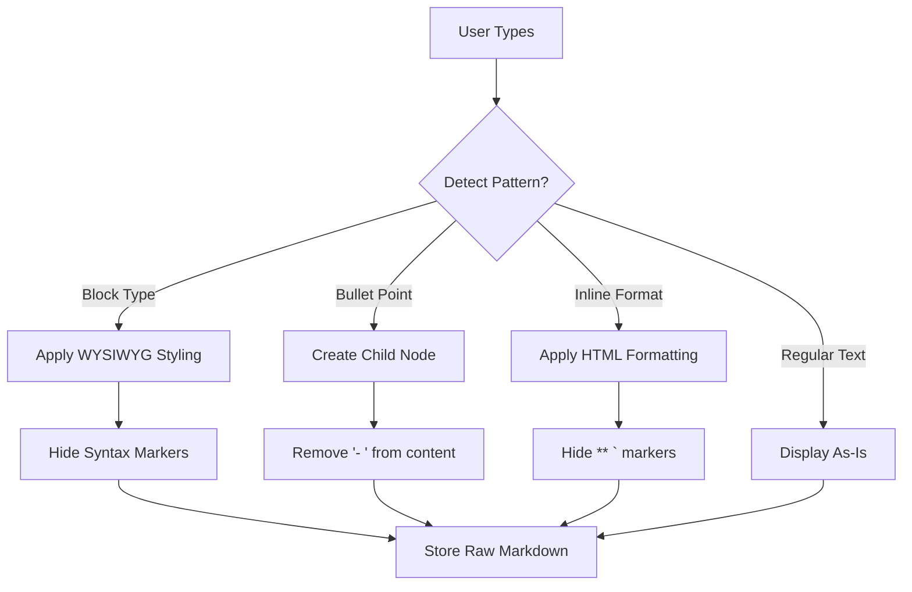

# ContentEditable Text Editing Architecture

## Overview

This document captures the comprehensive architectural decision to replace CodeMirror-based hybrid markdown rendering with a ContentEditable approach that features smart markdown-to-node conversion.

## Problem Analysis

### Current CodeMirror Implementation Issues
- **Cursor positioning problems**: Complex coordinate mapping between display and edit modes
- **Technical complexity**: Fighting against web standards to achieve hybrid rendering
- **User experience issues**: Flickering cursors, unpredictable behavior
- **Bundle size**: CodeMirror adds significant overhead for limited benefit

### Research Findings

#### UX Expert Analysis
- **Logseq investigation**: Uses clear edit/display mode switching, NOT true hybrid rendering
- **Industry patterns**: Successful editors (Notion, Craft) use hidden syntax + WYSIWYG
- **Mental model clarity**: Users prefer understanding edit vs display modes

#### mldoc Architecture Analysis  
- **Structured AST approach**: Parse markdown to structured representation
- **Position metadata**: Critical for cursor management and editing
- **Performance patterns**: Full re-parsing viable for reasonable document sizes

## Architectural Decision: ContentEditable + Smart Node Conversion

### Core Principles

1. **ContentEditable Foundation**: Leverage native browser text editing for reliability
2. **Markdown Storage**: Store raw markdown syntax in content field
3. **WYSIWYG Display**: Hide syntax markers, show formatted results
4. **Smart Conversion**: Transform markdown syntax into physical node relationships

### Key Innovation: Markdown-to-Node Conversion

Instead of competing hierarchy systems (physical nodes vs markdown bullets), convert markdown syntax into the existing physical node structure:

#### Bullet Point Magic
```
User Experience:
User types: "- Research competitors"
→ System detects "- " pattern
→ Removes "- " from content  
→ Creates child node relationship with previous node
→ Content becomes: "Research competitors" (indented as child)

Result:
Previous Node: "Project tasks"
├─ New Node: "Research competitors"  ← Physical child, no bullet needed
```

#### Soft Newline Intelligence  
```
User Experience:
User types: "Project overview:"
User presses Shift-Enter (soft newline - stays in same node)
User continues: "- First task"
→ System detects markdown after soft newline
→ Creates new child node with "First task" content
→ Maintains natural typing flow

Result:  
Node A: "Project overview:"
├─ Node B: "First task"  ← Automatically created and indented
```

## Technical Architecture

### Supported Syntax Patterns

#### Block-Level Types (4 patterns)
```javascript
const blockPatterns = {
  /^# (.+)$/: 'h1',      // Large 2.5rem header
  /^## (.+)$/: 'h2',     // Medium 2rem header  
  /^### (.+)$/: 'h3',    // Small 1.5rem header
  /^> (.+)$/: 'quote',   // Blockquote styling
  /^```(.*)$/: 'code'    // Code block (multi-line)
};
```

#### Inline Formatting (3 patterns)
```javascript
const inlinePatterns = {
  /\*\*(.*?)\*\*/g: '<strong>$1</strong>',  // Bold
  /\*(.*?)\*/g: '<em>$1</em>',              // Italic  
  /`(.*?)`/g: '<code>$1</code>'             // Inline code
};
```

#### Bullet-to-Node Conversion (1 special pattern)
```javascript
const nodeConversionPattern = {
  /^- (.+)$/: 'create_child_node'  // Convert to physical hierarchy
};
```

### Data Storage Model

#### Simple Content Field
```typescript
interface TextNode {
  content: string;  // Raw markdown: "# Header **bold** text"
  // No separate blockType prop needed - parse from content
}
```

#### Multi-line Support
```typescript
// Single node with multi-line markdown content
content: `> This is line one of the quote
> This is line two  
> And line three`

// OR code block
content: `\`\`\`javascript
const x = 1;
const y = 2;
\`\`\``
```

### Processing Pipeline

#### Input Processing Flow


#### Multi-line Block Behavior
- **Enter within quote**: Add new line with `> ` prefix (continue quote)
- **Enter twice in quote**: Exit quote block (return to normal text)  
- **Enter within code block**: Add new line (continue code)
- **``` on new line**: Exit code block

### Integration with Existing Systems

#### Keyboard Handler Compatibility
```typescript
// Existing system preserved:
// Tab → indent node (make child of previous sibling)
// Shift-Tab → outdent node (make sibling of parent)
// Enter → split content, create new sibling node
// Shift-Enter → soft newline within current node

// Enhanced behavior:
// Shift-Enter + markdown → create appropriate new node
// "- item" after soft newline → create child node
```

#### Hierarchy Visualization
- **Physical nodes** serve as the "list structure"  
- **Visual indicators** (connecting lines, node circles) show relationships
- **No competing hierarchies** - one consistent mental model

## Implementation Phases

### Phase 1: ContentEditable Foundation
**Goal**: Replace CodeMirror with reliable ContentEditable text editing

**Tasks**:
1. Replace CodeMirrorEditor.svelte with ContentEditableEditor.svelte
2. Implement basic markdown pattern detection (4 block + 3 inline)
3. Add WYSIWYG processing (hide syntax, show formatting)
4. Integrate with existing BaseNode.svelte structure

**Acceptance Criteria**:
- [ ] Users can type `# Header` and see large formatted text (syntax hidden)
- [ ] Inline formatting (`**bold**`, `*italic*`) works with hidden markers
- [ ] Multi-line quotes and code blocks render properly
- [ ] No cursor positioning issues or flickering

### Phase 2: Smart Node Conversion  
**Goal**: Implement intelligent markdown-to-node conversion

**Tasks**:
1. Implement bullet-to-node conversion (`- item` → child relationship)
2. Add soft newline + markdown detection (Shift-Enter intelligence)
3. Integration with existing keyboard handlers (Tab/Shift-Tab)
4. Handle nested bullet scenarios

**Acceptance Criteria**:
- [ ] `- item` creates properly indented child nodes
- [ ] Shift-Enter + markdown creates appropriate new nodes
- [ ] Tab/Shift-Tab system continues to work
- [ ] Nested bullets create proper hierarchy levels

### Phase 3: AI Integration & Polish
**Goal**: Perfect markdown import/export and performance optimization

**Tasks**:
1. Markdown import functionality (convert .md files to node structure)
2. Markdown export functionality (convert node tree to .md)
3. Performance optimization and edge case handling
4. Comprehensive testing with existing systems

**Acceptance Criteria**:
- [ ] Can import .md files and convert to proper node structure
- [ ] Can export node tree as valid markdown  
- [ ] AI-generated markdown content converts seamlessly
- [ ] Performance is fast and responsive

## Benefits Analysis

### Technical Benefits
- ✅ **Eliminates cursor positioning issues** - ContentEditable handles naturally
- ✅ **Simpler architecture** - Standard web patterns vs complex hybrid rendering
- ✅ **Better performance** - Native browser text editing optimizations
- ✅ **Smaller bundle size** - Remove CodeMirror dependency (~19% reduction achieved)
- ✅ **More reliable** - Fewer edge cases and browser compatibility issues

### User Experience Benefits
- ✅ **Fast markdown typing** - Users get familiar `# Header`, `- bullet` syntax
- ✅ **Intelligent hierarchy building** - Bullets become actual parent/child relationships  
- ✅ **No competing mental models** - One hierarchy system (physical nodes)
- ✅ **Enhanced node capabilities** - Each "bullet" becomes full-featured node
- ✅ **Perfect AI integration** - Seamless import of ChatGPT/Claude markdown content

### Architectural Benefits
- ✅ **Preserves existing systems** - Tab/Shift-Tab indenting continues to work
- ✅ **Enhances capabilities** - Multi-line blocks, rich formatting, node features
- ✅ **Future extensibility** - Easy to add new markdown patterns
- ✅ **Consistent with design system** - Uses NodeSpace typography scale

## Migration Strategy

### Code Organization
- **Keep current work as reference**: `feature/issue-26-hybrid-markdown-reference`
- **Start fresh from main**: `feature/contenteditable-text-editing`  
- **Cherry-pick valuable components**: Performance improvements, documentation, design system integration

### Backward Compatibility
- **Content storage**: Existing content remains compatible (already markdown)
- **Keyboard shortcuts**: All existing shortcuts preserved and enhanced
- **Node relationships**: Existing parent/child structure unchanged
- **Visual hierarchy**: Existing connecting lines and indicators work better

### Risk Mitigation
- **ContentEditable challenges**: Use proven patterns, comprehensive testing
- **Browser compatibility**: Focus on modern browsers, graceful degradation
- **Performance concerns**: Profile with large documents, optimize as needed  
- **User experience**: Extensive testing with different typing patterns

## Success Metrics

### Technical Metrics
- **Zero cursor positioning bugs** - No flickering or jumping cursors
- **Performance**: < 50ms response time for pattern detection and conversion
- **Bundle size**: Maintain or improve current size (CodeMirror removal)
- **Browser compatibility**: Works consistently across Chrome, Firefox, Safari

### User Experience Metrics  
- **Typing speed**: No noticeable delay in markdown pattern conversion
- **Learning curve**: Users can discover and use bullet-to-node conversion intuitively
- **Error recovery**: Robust undo/redo, graceful handling of edge cases
- **AI integration**: Seamless import of markdown content from AI tools

## Future Enhancements

### Advanced Markdown Support
- **Tables**: Convert markdown tables to structured data
- **Links**: Enhanced link handling and preview
- **Images**: Drag/drop image insertion with markdown syntax
- **Custom blocks**: Extensible system for new node types

### Enhanced AI Integration
- **Smart parsing**: Detect and preserve complex document structures
- **Real-time collaboration**: Multi-user editing with conflict resolution
- **Content suggestions**: AI-powered writing assistance integrated with editing

## Conclusion

This ContentEditable approach with smart markdown-to-node conversion represents a significant architectural improvement that:

1. **Solves fundamental technical issues** with cursor positioning and complexity
2. **Enhances user experience** with intuitive typing patterns and intelligent conversion
3. **Maintains architectural consistency** with existing node hierarchy systems
4. **Enables perfect AI integration** through native markdown support
5. **Provides foundation for future enhancements** with extensible, standards-based approach

The decision moves NodeSpace from fighting against web standards to leveraging them, resulting in a more reliable, performant, and user-friendly text editing experience.

---

**Decision Date**: January 2025  
**Status**: Approved for Implementation  
**Next Steps**: Create GitHub issues and begin Phase 1 implementation